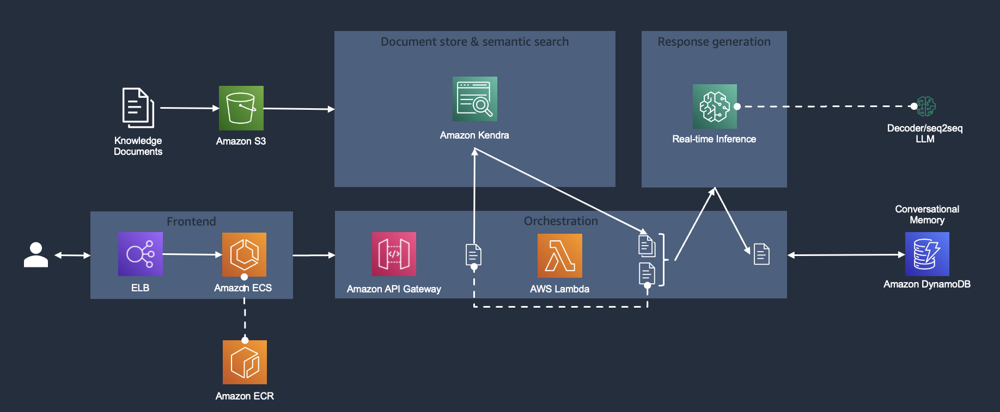
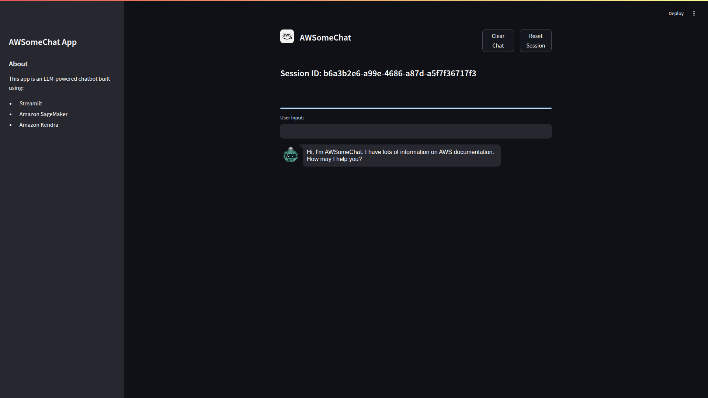
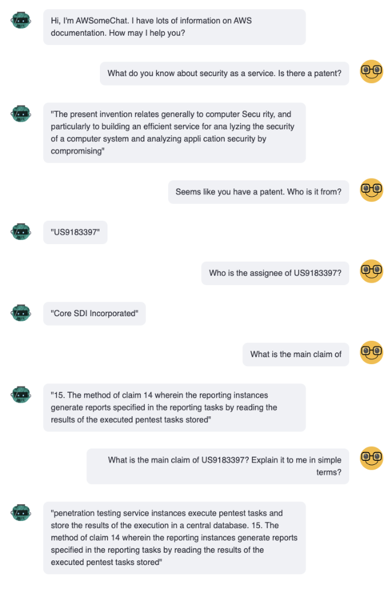

# AWS-RAG-APP

An LLM Powered RAG Q&A chat bot deployed end-to-end on AWS cloud utilizing AWS's services such as AWS Kendra, AWS Lambda, AWS ECS,S3 and Dynamo DB.

This Chatbot is build and deployed on AWS using:-

* Streamlit
* Amazon Sagemaker
* Amazon Kendra

The above figure gives the overview of this RAG app. 
It consists of the following components:
* Document store & semantic search: We leverage semantic document search service Amazon Kendra as fully managed embeddings/vector store as well as for a fully managed solution for document retrieval based on questions/asks in natural language.
* Response generation: For the chatbot response generation, we use the open-source encoder-decoder model FLAN-T5-XXL conveniently deployed in a one-click fashion through Amazon SageMaker JumpStart right into your VPC.
* Orchestration layer: For hosting the orchestration layer implmented with the popular framework langchain we choose a serverless approach. The orchestration layer is exposed as RESTful API service via a Amazon API Gateway.
* Conversational Memory: In order to be able to keep track of different chatbot conversation turns while keeping the orchestration layer stateless we integrate the chatbot's memory with Amazon DynamoDB as a storage component.
* Frontend: The chatbot frontend is a web application hosted in a Docker container on Amazon ECS. For storing the container image we leverage Amazon ECR. The website is exposed through an Amazon Elastic Load Balancer.

Note:
Please update your Kendra Index Id in the template.yml to use it, I have removed my ID.
